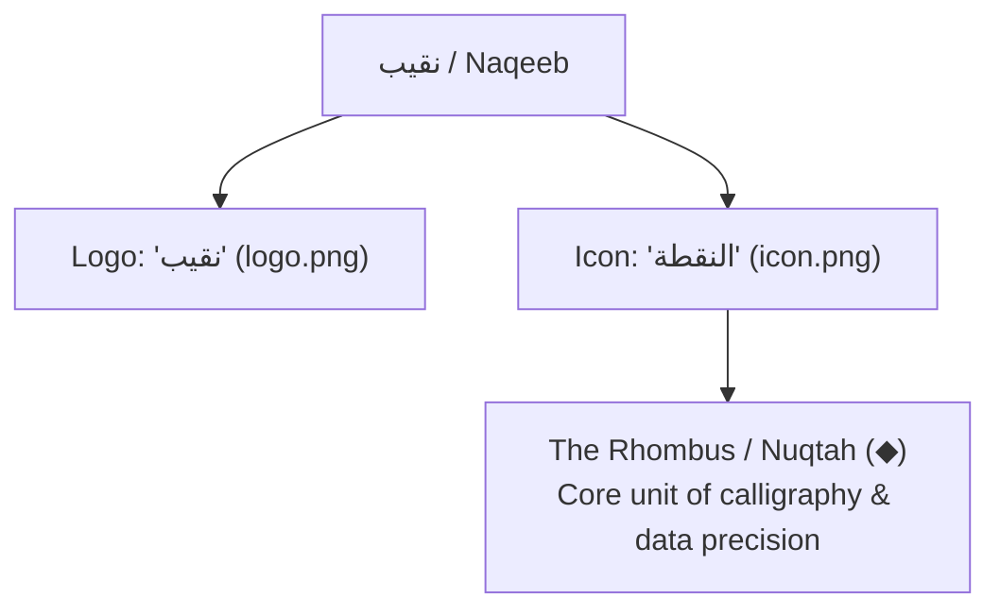

<!-- GENERATED by $impeccable document -- Scan Mode -->

---
name: نقيب | Naqeeb
description: نظام التنقيب الذكي واستخراج بيانات المتاجر - Intelligence Data Mining Suite
colors:
  primary: "#000000"
  primary-hover: "#1f2937"
  neutral-black: "#000000"
  neutral-charcoal: "#374151"
  neutral-gray: "#9ca3af"
  neutral-light-gray: "#e5e7eb"
  neutral-white: "#ffffff"
  background: "#ffffff"
  success: "#10b981"
  error: "#ef4444"
  warning: "#f59e0b"
typography:
  display:
    fontFamily: "Cairo, Outfit, sans-serif"
    fontSize: "2.25rem"
    fontWeight: 700
    lineHeight: 1.2
  body:
    fontFamily: "Cairo, Outfit, sans-serif"
    fontSize: "1rem"
    fontWeight: 400
    lineHeight: 1.6
  label:
    fontFamily: "Cairo, Outfit, sans-serif"
    fontSize: "0.875rem"
    fontWeight: 500
rounded:
  sm: "6px"
  md: "10px"
  lg: "16px"
  xl: "24px"
  full: "9999px"
spacing:
  sm: "8px"
  md: "16px"
  lg: "24px"
  xl: "32px"
components:
  button-primary:
    backgroundColor: "{colors.primary}"
    textColor: "#ffffff"
    rounded: "{rounded.md}"
    padding: "12px 24px"
  button-primary-hover:
    backgroundColor: "{colors.primary-hover}"
  card-default:
    backgroundColor: "#ffffff"
    rounded: "{rounded.xl}"
    padding: "32px"
    border: "1px solid {colors.neutral-light-gray}"
---

# Design System: نقيب (Naqeeb)

## 1. Overview

**Creative North Star: "The Sharp Scout" (المنقب الدقيق)**

**نقيب (Naqeeb)** is an elite, high-precision data extraction and lead intelligence suite. Unlike typical noisy, cluttered dashboards, **نقيب** adopts an ultra-minimalist, high-contrast, premium monochrome aesthetic. It focuses entirely on data clarity, structured typography, and absolute precision.

The design relies on a stark black-and-white grid structure, utilizing elegant shades of charcoal and ash gray for hierarchy, and rejecting colorful decorative flourishes. Color is used strictly for functional purposes (success, error, warning).

### Key Brand Characteristics
*   **Monochrome Sophistication**: A pure white background paired with deep black elements and premium gray hierarchy.
*   **The Concept of "Nuqtah" (النقطة)**: The brand's signature mark is a solid black rhombus (`◆`), which serves as the calligraphic dot (Nuqtah) of Arabic script, representing a single, precise, and high-value "data point" extracted from the web.
*   **Structured Precision**: Thin elegant borders (1px) and generous whitespace ensure that dense data tables and reports remain highly readable and breathable.
*   **Arabic-First RTL Excellence**: Optimized layout flows, typography scales, and alignments crafted natively for Arabic reading patterns.

---

## 2. Colors

The color palette is strictly disciplined, adopting the monochrome structure from the brand identity mockup.

### Primary & Accent
*   **Deep Black** (`#000000`): The core brand color. Used for the primary logo, key call-to-actions, headers, active states, and focus indicators.
*   **Slate Black/Hover** (`#1f2937`): Used for interactive hover states of primary elements.

### Neutrals (The Grayscale Grid)
*   **Pure White** (`#ffffff`): The primary background color. Ensures a spacious, clean, and professional canvas.
*   **Ash Gray** (`#e5e7eb` / `#f3f4f6`): Used for subtle borders, secondary list backgrounds, and disabled states.
*   **Medium Gray** (`#9ca3af`): Used for placeholding text, borders, and inactive status indicators.
*   **Charcoal Gray** (`#374151`): Used for body text, secondary tags, and structural subheadings.

### Functional States
*   **Emerald Success** (`#10b981`): Used strictly for verified leads, successful extractions, and positive signals.
*   **Rose Error** (`#ef4444`): Used strictly for failed tasks, system errors, and delete actions.
*   **Amber Warning** (`#f59e0b`): Used strictly for pending tasks, rate limits, or warnings.

> [!IMPORTANT]
> **The Strict Grayscale Rule**: Decorative colors are entirely forbidden. Every non-grayscale color in the dashboard must convey a functional system state (success, error, or warning).

---

## 3. Brand Assets (Logo & Mini Logo)

The brand identity utilizes two core graphic assets located in `/public`:

| Asset | File Path | Graphic Description | Brand Significance |
| :--- | :--- | :--- | :--- |
| **Main Logo** | [logo.png](file:///Users/user/Documents/sallahunter-pro/public/logo.png) | Elegant, bold Arabic typographic rendering of **"نقيب"** | Commands authority, represents the investigative and intelligence nature of the platform. |
| **Mini Logo (Icon)** | [icon.png](file:///Users/user/Documents/sallahunter-pro/public/icon.png) | A perfect, solid black rhombus / diamond (`◆`) | Represents the **"Nuqtah" (النقطة)** — the dot in Arabic typography (noon, qaf, baa). In data terms, it represents the absolute unit of precision: a single, high-value data point. |

---

## 4. Typography

### Primary Font Stack
*   **Arabic Text**: `Cairo` (a beautiful, highly readable geometric Arabic font).
*   **English/Numerical Text**: `Outfit` or `Inter` (geometric sans-serif fonts matching the minimalist tone).

### Typographic Hierarchy

*   **Display Header** (700, `2.25rem / 36px`, line-height `1.2`): Used for main page titles and primary brand statements.
*   **Section Title** (700, `1.5rem / 24px`, line-height `1.3`): Used for main dashboard cards and section dividers.
*   **Sub-headline** (600, `1.25rem / 20px`, line-height `1.4`): Used for subsection headers and tables.
*   **Body Copy** (400, `1rem / 16px`, line-height `1.6`): Standard copy, instructions, and list details. Max line length `75ch` for comfortable Arabic reading.
*   **Labels & Metadata** (500, `0.875rem / 14px`): Table headers, buttons, microcopy, and input labels.
*   **Captions** (400, `0.75rem / 12px`): Sub-text and help notes.

> [!TIP]
> Pair bold weights (`700`) with light borders to create immediate, powerful visual hierarchy without needing colors.

---

## 5. Layout & Spacing

**نقيب** is flat-by-default, relying on structural hierarchy, 1px borders, and generous margins to define sections rather than drop shadows.

*   **Borders**: 1px solid `#e5e7eb` (Ash Gray) to separate elements and contain lists.
*   **Corner Radii**:
    *   `24px` (`rounded-xl` / `rounded-3xl` equivalent) for primary dashboard cards.
    *   `10px` (`rounded-md` equivalent) for primary buttons and text input fields.
    *   `6px` (`rounded-sm` equivalent) for chips, badges, and the mini logo container.
*   **Interactive Shadows**:
    *   Flat at rest.
    *   On hover: Subtle, tight elevation shadow (`0 4px 12px rgba(0, 0, 0, 0.05)`).

---

## 6. Component Spec

### Buttons
*   **Primary Button**: Solid Deep Black (`#000000`) background, white text, `12px` vertical × `24px` horizontal padding, 500 weight, `10px` corner radius.
    *   *Hover state*: Lighter gray (`#1f2937`).
    *   *Focus state*: Solid 2px outline offset.
*   **Secondary Button**: White background, 1px black border, black text.
*   **Ghost Button**: Transparent background, charcoal text.

### Cards
*   White background, `24px` corner radius, 1px `#e5e7eb` border, spacious interior padding (`24px` to `32px`).

### Inputs
*   White background, 1px `#e5e7eb` border, `10px` corner radius, `12px` × `16px` padding.
    *   *Focus state*: Border transitions to solid black (`#000000`), with an elegant, tight gray focus ring.

### Data Tables
*   **Headers**: Flat ash gray background, black bold text, 1px border at the bottom.
*   **Rows**: Pure white background, separated by thin 1px `#f3f4f6` borders. Hovering a row highlights it with a very subtle background tint (`#fafafa`).

---

## 7. Do's and Don'ts

### Do:
*   **Do** keep the design strictly monochrome. Let typography and spacing do the heavy lifting.
*   **Do** integrate the "Nuqtah" (`◆` / `icon.png`) as a custom bullet point, active indicator, or visual marker.
*   **Do** use Cairo for Arabic script, ensuring full RTL compatibility with precise tracking.
*   **Do** display functional states clearly (using standard success emerald and rose red), keeping them constrained only to states.

### Don't:
*   **Don't** use colorful gradients, shadows, or rounded corners of varying, inconsistent scales.
*   **Don't** use orange, blue, or other accent colors that clash with the brand's premium monochrome palette.
*   **Don't** crowd data cells. Leave ample breathing room for digits and labels.

---

## 8. Developer & Agent Implementation Guide

When adding new interfaces, modifying components, or working on pages for **نقيب**:

1.  **Strict Monochrome Compliance**: Set your Tailwind / CSS values to `bg-white`, `text-black`, `border-gray-200`, etc.
2.  **Arabic Typography first**: Ensure that the language direction is `dir="rtl"` and that standard typography loads the `Cairo` font for premium Arabic rendering.
3.  **Nuqtah Alignment**: When displaying bullets or steps, use the black diamond/rhombus symbol `◆` or `icon.png` as a beautiful, premium visual signature.
4.  **No Clichés**: Avoid standard colorful gradients and generic SaaS dashboard components. Design with structural integrity, solid borders, and bold typography.
