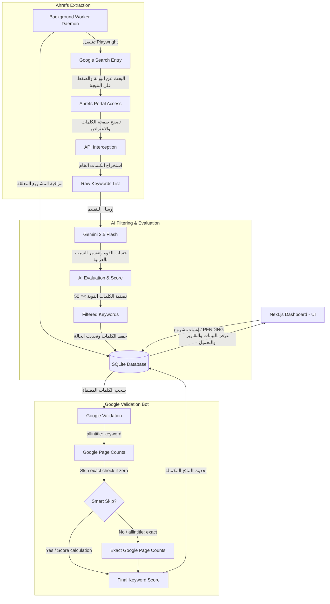

# دليل بنيان ومشروع صائد الكلمات المفتاحية (Keyword Hunter AI)

مستند تعريفي وتوضيحي شامل لهيكل المشروع، قاعدة البيانات، والتدفق البرمجي الكامل للعمليات.

---

## 🗺️ الهيكل العام للمشروع (Architecture Overview)

يعتمد مشروع **Keyword Hunter AI** على معمارية منفصلة ولكنها متكاملة عبر قاعدة بيانات مشتركة:
1. **الواجهة الأمامية والـ APIs (Next.js Dashboard)**: لإدارة المشاريع، عرض الكلمات المستخرجة، مراجعة تحليلات الذكاء الاصطناعي، وتعديل إعدادات المتصفح ومفاتيح الربط.
2. **محرك المعالجة في الخلفية (Background Worker)**: برنامج خدمي مستقل يعمل بشكل مستمر لمراقبة قاعدة البيانات ومعالجة المشاريع خطوة بخطوة بالاعتماد على **Playwright** و**Gemini AI**.



---

## 📂 هيكل المجلدات والملفات (Directory Structure)

```bash
test_hetfs/
├── prisma/
│   ├── dev.db               # قاعدة بيانات SQLite المحلية
│   └── schema.prisma        # هيكل النماذج وجداول قاعدة البيانات
├── src/
│   ├── app/                 # تطبيق Next.js (App Router)
│   │   ├── api/             # مسارات الـ API الخلفية لـ Next.js
│   │   │   ├── projects/    # إنشاء وحذف وجلب المشاريع والكلمات
│   │   │   └── settings/    # جلب وتحديث الإعدادات العامة للبوت
│   │   ├── settings/        # صفحة إعدادات البوت في الواجهة الأمامية
│   │   ├── layout.tsx       # الهيكل والتنسيق العام للموقع
│   │   ├── globals.css      # ملفات التنسيق والألوان والأنماط (Vanilla CSS)
│   │   └── page.tsx         # لوحة التحكم الرئيسية وعرض الكلمات والمشاريع
│   ├── lib/
│   │   ├── db.ts            # تهيئة Prisma Client لمخزن البيانات
│   │   └── settings.ts      # دوال منطق استرجاع وإعداد البيانات الافتراضية
│   └── worker.ts            # محرك المعالجة والذكاء الاصطناعي الأساسي في الخلفية
├── .env                     # ملف متغيرات البيئة (روابط قواعد البيانات والبوابة)
├── package.json             # ملف الحزم والتبعيات البرمجية والتشغيل
└── tsconfig.json            # إعدادات مترجم لغة TypeScript للمشروع
```

---

## 🗄️ معمارية قاعدة البيانات (Database Schema)

نعتمد على **SQLite** كقاعدة بيانات خفيفة وسريعة محلياً، ومُدارة بواسطة **Prisma ORM**:

### 1. جدول المشاريع `Project`
يتعقب هذا الجدول حالة الفحص الكلية للمواقع والمواقع المستهدفة:
* `id`: معرف فريد للمشروع (UUID).
* `domain`: النطاق المطلوب فحصه (مثل `salla.sa`).
* `country`: الدولة المستهدفة (الافتراضي `Saudi Arabia`).
* `status`: حالة المشروع الحالية:
  * `PENDING`: قيد الانتظار للتشغيل.
  * `EXTRACTING_AHREFS`: مرحلة سحب الكلمات من Ahrefs.
  * `VALIDATING_GOOGLE`: مرحلة فحص الكلمات عبر Google.
  * `COMPLETED`: اكتمال الفحص بنجاح.
  * `FAILED`: فشل الفحص مع تسجيل سبب الخطأ.
* `errorMessage`: تفاصيل سبب الفشل إن وُجد.
* `totalKeywords`: إجمالي الكلمات التي اجتازت تصفية الذكاء الاصطناعي.
* `processedKeywords`: الكلمات التي تم الانتهاء من فحصها عبر Google.

### 2. جدول الكلمات المفتاحية `Keyword`
يخزن تفاصيل كل كلمة مفتاحية مرتبطة بالمشروع مع تحليلات الذكاء الاصطناعي وجوجل:
* `id`: معرف الكلمة المفتاحية.
* `projectId`: معرف المشروع الأب (علاقة Cascade للحذف التلقائي للمشروع بأكمله).
* `keyword`: النص الخاص بالكلمة المفتاحية.
* `volume`: حجم البحث الشهري للكلمة (من Ahrefs).
* `traffic`: الزيارات التقريبية المقدرة (من Ahrefs).
* `kd`: درجة صعوبة الكلمة (من Ahrefs).
* `allintitle`: عدد نتائج البحث بطلب `allintitle:keyword` على Google.
* `exactAllintitle`: عدد نتائج البحث بالصيغة المطابقة الدقيقة `allintitle:"keyword"` على Google.
* `score`: درجة المنافسة والسهولة المحسوبة برمجياً (0-100).
* `aiScore`: تقييم قوة الكلمة ونوايا البحث بواسطة Gemini (0-100).
* `aiReason`: تبرير تقييم الذكاء الاصطناعي مكتوباً باللغة العربية بوضوح ودقة.

### 3. جدول الإعدادات `Setting`
لتخزين إعدادات تشغيل البوت بمفتاح وقيمة (مثل مفتاح Gemini، مسار ملف متصفح Chrome، فترات الانتظار لتفادي كابتشا جوجل، وحجم الدفعات).

---

## ⚙️ تدفق المعالجة البرمجي بالتفصيل (Detailed Workflow)

يتلخص منطق عمل البوت في المعالجة بالخطوات الآتية:

```
[إضافة مشروع في لوحة التحكم] 
       ↓
[Worker يلتقط المشروع PENDING ويحدث حالته إلى EXTRACTING_AHREFS]
       ↓
[تشغيل Playwright بالملف التعريفي الفعلي لـ Chrome]
       ↓
[تصفح Google والبحث عن رابط البوابة والضغط عليه كزائر عضوي لتوثيق الجلسة]
       ↓
[الانتقال لصفحة الكلمات المفتاحية للبوابة واعتراض استجابة الـ API للحصول على الكلمات]
       ↓
[إرسال الكلمات لـ Gemini AI لتقييم النية التجارية وقوة الكلمة وتبرير السبب]
       ↓
[تصفية الكلمات ذات تقييم الذكاء الاصطناعي المنخفض وحفظ القوي منها بالداتا بيز]
       ↓
[تحديث الحالة لـ VALIDATING_GOOGLE وبدء روبوت جوجل المفتوح]
       ↓
[لكل كلمة: فحص allintitle -> إذا كانت صفر، يتم وضع المطابقة الدقيقة بصفر تلقائياً وتسريع الوقت]
       ↓
[حساب الدرجة النهائية، وتحديث التقدم بقاعدة البيانات لمنع الانهيار بحالات الحذف يدوياً]
       ↓
[تحويل الحالة لـ COMPLETED واكتمال المشروع وعرضه للمستخدم مع إمكانية التصدير]
```

---

> [!TIP]
> يمنح هذا البنيان مرونة قصوى؛ حيث يظل الخادم التابع للواجهة الرسومية (Next.js) مستقراً تماماً وخفيفاً، بينما يقوم محرك الخلفية (Worker) بالمعالجة الصعبة وحل الكابتشا دون التأثير على تصفح المستخدم وتجربته.
